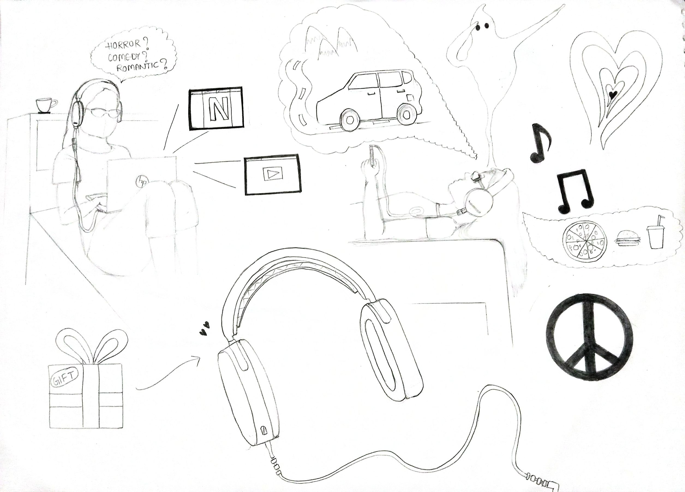
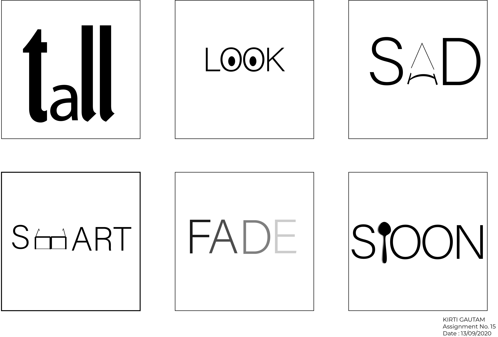

<!DOCTYPE HTML>
<!--
	Forty by HTML5 UP
	html5up.net | @ajlkn
	Free for personal and commercial use under the CCA 3.0 license (html5up.net/license)
-->
<html>
	<head>
		<title>KIRTI GAUTAM</title>
		<meta charset="utf-8" />
		<meta name="viewport" content="width=device-width, initial-scale=1, user-scalable=no" />
		<link rel="stylesheet" href="main.css" />
		<noscript><link rel="stylesheet" href="noscript.css" /></noscript>
	</head>
	<body class="is-preload">

		<!-- Wrapper -->
			

				<!-- Header -->
					<header id="header" class="alt">
						<a href="home.md" class="logo"><strong>KIRTI</strong> GAUTAM</a>
						<nav>
							<a href="#menu">Menu</a>
						</nav>
					</header>

				<!-- Menu -->
					<nav id="menu">
						<ul class="links">
							<li><a href="home.md">Home</a></li>
							<li><a href="about.md">About Me</a></li>
							<li><a href="stuff.md">Stuff I did</a></li>
							<li><a href="typo.md">Interactive Typography</a></li>
							<li><a href="4th.md">Final Thoughts</a></li>
						</ul>
					</nav>

				<!-- Banner -->
					<section id="banner" class="major">
						

							<header class="major">
								<h1>Hi, I am Kirti Gautam</h1>
							</header>
							

								
Computer Science and Design 
								2023

								<ul class="actions">
									<li><a href="#one" class="button next scrolly">Let's Go!</a></li>
								</ul>
							

						

					</section>

				<!-- Main -->
					

						<!-- One -->
							<section id="one" class="tiles">
								<article>
									
										
									
									<header class="major">
										<h3><a href="about.md" class="link">About me</a></h3>
										
What I am about

									</header>
								</article>
								<article>
									
										
									
									<header class="major">
										<h3><a href="stuff.md" class="link">Stuff I did</a></h3>
										
Some designing here and there

									</header>
								</article>
								<article>
									
										
									
									<header class="major">
										<h3><a href="typo.md" class="link">Interactive Typography</a></h3>
										
A DIS Component

									</header>
								</article>
								<article>
									
										
									
									<header class="major">
										<h3><a href="4th.md" class="link">Final Thoughts</a></h3>
										
What I think about DIS

									</header>
								</article>
								
							</section>
					

			

		<!-- Scripts -->
			
			
			
			
			
			
			

	</body>
</html>
